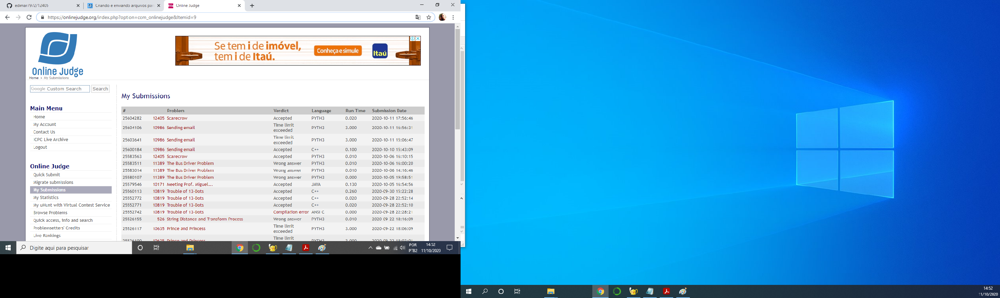

# Trabalho de Programação -- Algoritmos Gulosos -- Parte 1
**Autor:** Edimar Antonio da Cruz
**Data:** 11 de outubro de 2020
**Problema:** 11389 -- The Bus Driver Problem
## Sobre a Solução
Este diretório contém o código fonte gerado para solucionar o problema 10389
do *Online Judge*. O problema recebeu veredito \Wrong answer", como mostrado na
figura abaixo:

O programa foi desenvolvido em Python. consegui resolver para alguns testes
mas quando submetido ao debug, não era todos os casos que resolvia com exatidão
